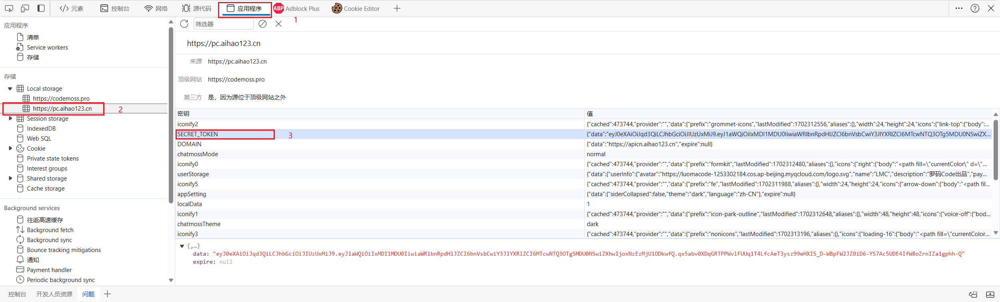

# [CodeMoss](https://codemoss.pro/)每日签到

## 如何使用？

1. Fork项目到自己的仓库
2. 点击Settings -> 点击选项卡 Secrets and variables -> 点击Actions -> New repository secret

    | Name   | Secret                           |
    | ------ | ------------------------------- |
    | TOKEN *   | CodeMoss的Token 可以添加多个用英文逗号(,)分割 无需空格  |

以上TOKEN为签到必填项！
3. 点击Actions -> 选择 codemoss-checkin -> 点击Run workflow 运行即可

### 如何获取CodeMoss的TOKEN？

浏览器登录CodeMoss后，按F12打开开发者工具，然后按下图路径找到TOKEN  

### 其它设置

- 自动签到时间修改.github/workflows/checkin.yml文件 cron项即可实现
  - 该cron指定的是格林尼治时间（UTC），如果需要换算成北京时间，要在该cron的基础上增加八小时得到北京时间。
